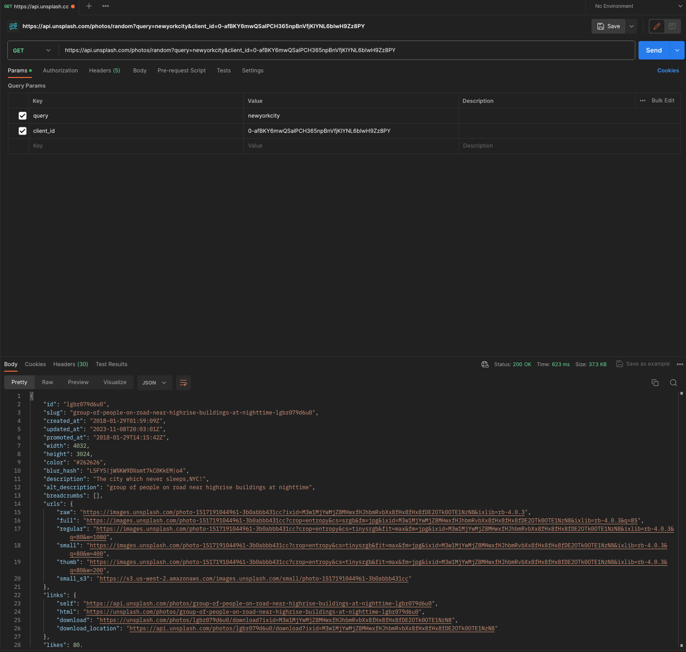
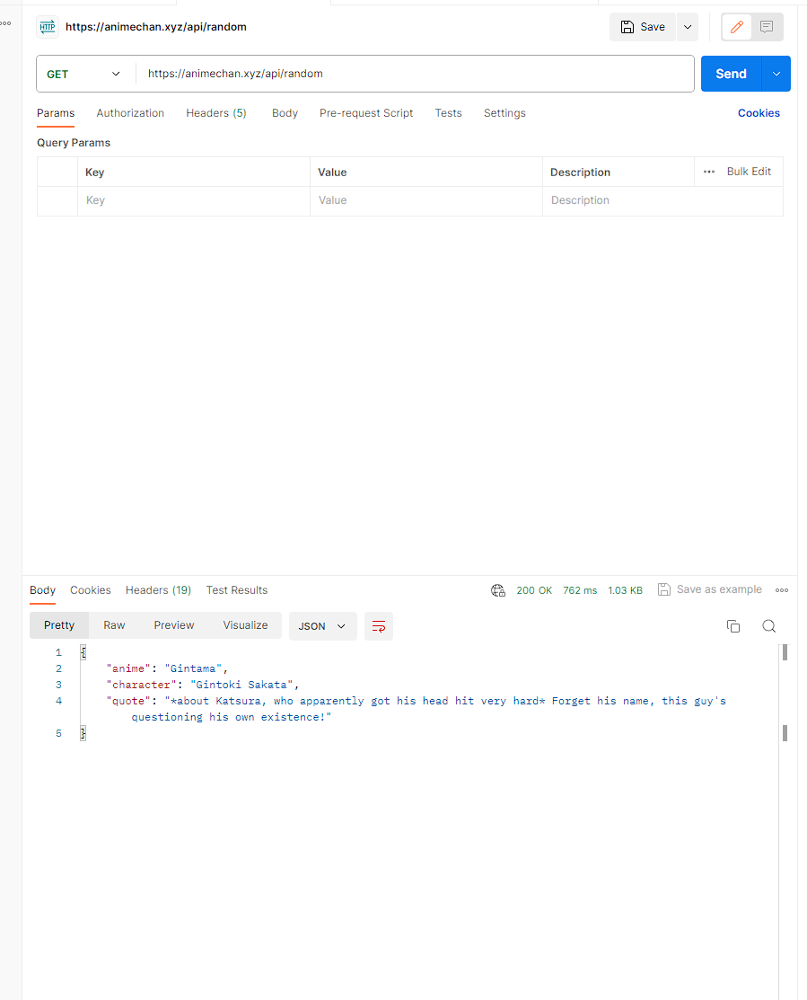

# API Assignment
# Image API
API Provider : Unsplash
API Name : Unsplash API
Screenshot of a successful API test in Postman for that endpoint

Link to the API documentation : https://unsplash.com/documentation#get-a-random-photo

I used this API to generate a random image of New York City, as we did a weather app based in new york.  Only issue I had was the image was not generating properly, but that was due to the fact that I didn't display the imagedata in the code properly.
# News API
This API gets some recent headlines based on some parameters. I could have gone with everything, but I decided to cater it to the current audience, so it displays Science News for the US.

The above is a successful Postman call to said API. Here is a link to the documentation: https://newsapi.org/docs

# Anime Quote API
API Provider: Animechan
API Name: Animechan

Link to API documentation: https://animechan.xyz/

Used API to pull a quote from an anime character at random. It is hilariously random, hopefully it doesn't retrieve
anything that might get us in trouble.

# Weather API
API Provider: Accuweather
API Name: Accuweather

Link to API documentation: https://developer.accuweather.com/apis

This api display weather data for New York. This entire project is for any Neet living in New York that wants to know the weather, daily news, and some anime quotes to start his/her day.
